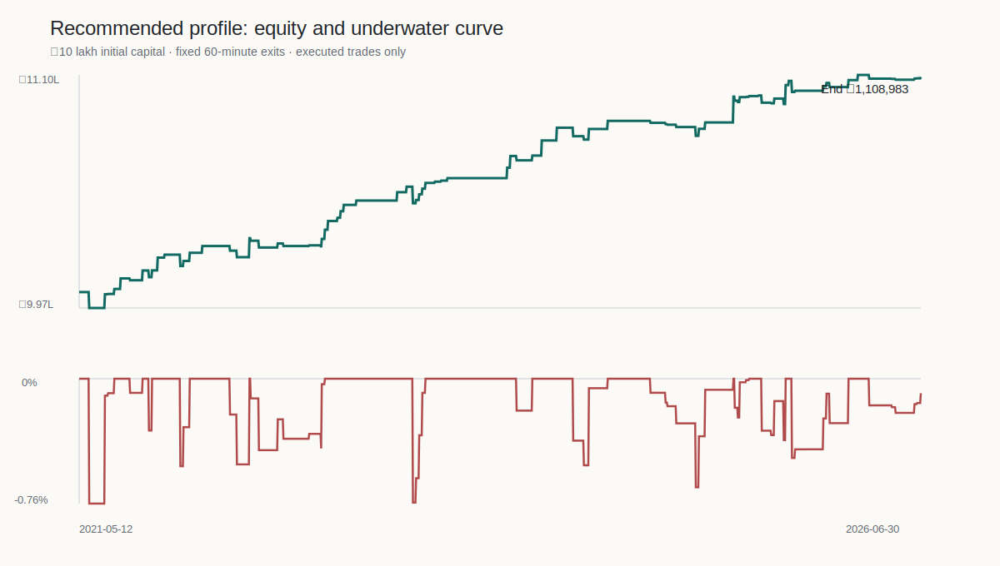
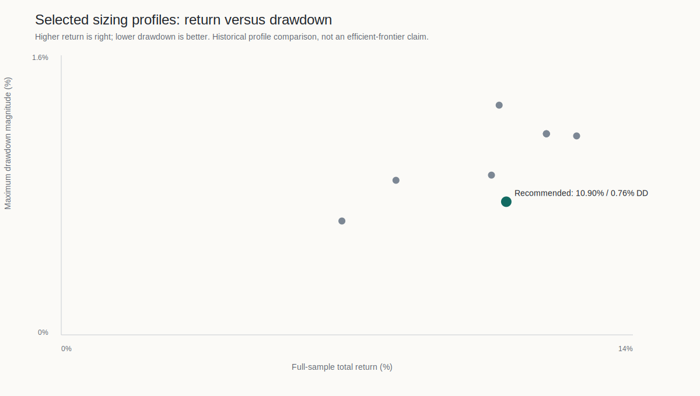
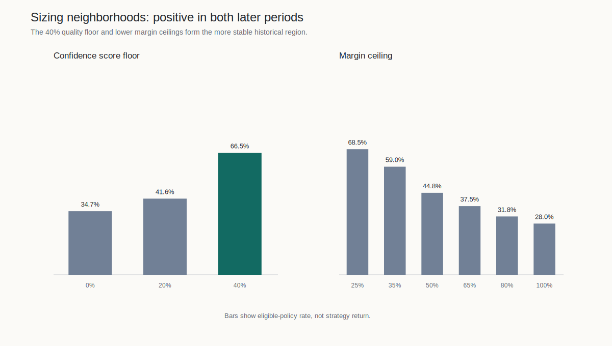

# Module 4 — sizing and risk management

This package closes the sizing and risk-management work that follows the rejected standalone
Module 3 VRP hypothesis. It preserves the corrected quantity-aware impact model, the ₹10 lakh
gated capital backtest, the confidence-ranking diagnostic, the 17,640-policy sizing exploration,
and the frozen candidate selected only on 2021–2023.

The retained candidate is **not deployment approved**. It is a fully specified forward-shadow
candidate because the historical capital path is positive, but the Phase 9 combined-holdout
bootstrap interval for score/P&L rank correlation still crosses zero.

## Frozen candidate

- Signal: upper-85 normalized intraday VRP crossing upward, with the three causal IV/RV gates.
- Structure: nearest-weekly NIFTY short iron fly, ATM±3 legs, 60-minute fixed exit.
- Quality switch: frozen composite score strictly above 40%, with no continuous scaling.
- Capital: ₹10,00,000 initial equity; 35% entry-SPAN cap and 4% cost-reserved defined-loss cap.
- Capacity: corrected quantity-aware impact model and 76-lot research ceiling.
- Risk overlays: no fitted drawdown or losing-streak brake.

See [`contracts/strategy.json`](contracts/strategy.json) for the machine-readable contract and
[`results/closeout_report.md`](results/closeout_report.md) for the consolidated research note.

## Module map

```text
module4_sizing_risk_management/
├── contracts/        frozen strategy and acceptance state
├── docs/             architecture, research note, and rerun contract
├── results/          trade sheet, curves, diagnostics, figures, and hashes
├── scripts/          one-command PowerShell wrapper
├── closeout.py       deterministic artifact builder and reconciler
├── run.py            build/verify CLI
├── module.yaml       ownership and must-not boundaries
└── MODULE_MANIFEST.md
```

Canonical calculations remain in `research/phase8`, `research/phase9`, and `research/phase10`.
This wrapper reconciles and packages those outputs; it does not maintain a second strategy engine.

## Rebuild the packet

```powershell
python -m research.module4_sizing_risk_management.run build
python -m research.module4_sizing_risk_management.run verify
python -m pytest tests/test_module4_sizing_risk_management.py -q
```

For a complete Phase 8–10 rerun from the local gold Parquets, use the commands in
[`docs/runbook.md`](docs/runbook.md). The full policy grid is retained in deterministic gzip form,
while the exact-lot fly cost surface is retained as Parquet.

## Principal outputs

- [`recommended_trade_sheet.csv`](results/trades/recommended_trade_sheet.csv): 132 signals,
  including explicit non-entries and complete per-trade cost/risk attribution.
- [`recommended_equity_curve.csv`](results/curves/recommended_equity_curve.csv): business-day
  capital path with peak and drawdown.
- [`profile_comparison.csv`](results/diagnostics/profile_comparison.csv): discovery-selected
  profile alternatives.
- [`sizing_grid.csv.gz`](results/exploration/sizing_grid.csv.gz): all 17,640 policies.
- [`manifest.json`](results/manifest.json): SHA-256 lineage for sources, code, documents, and
  generated outputs.






